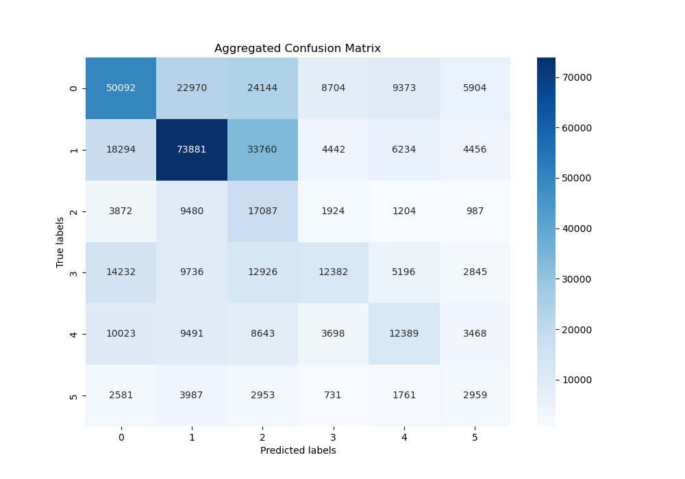
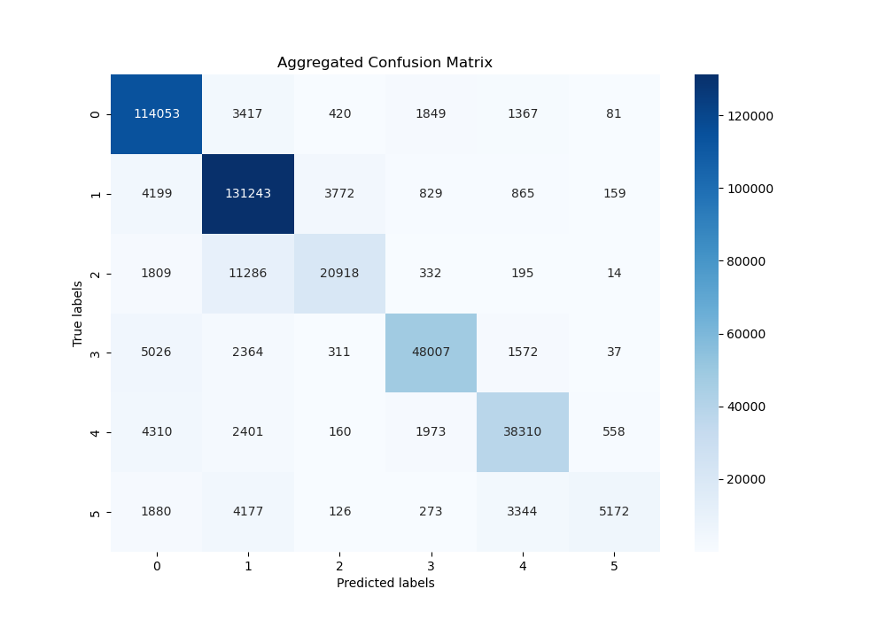
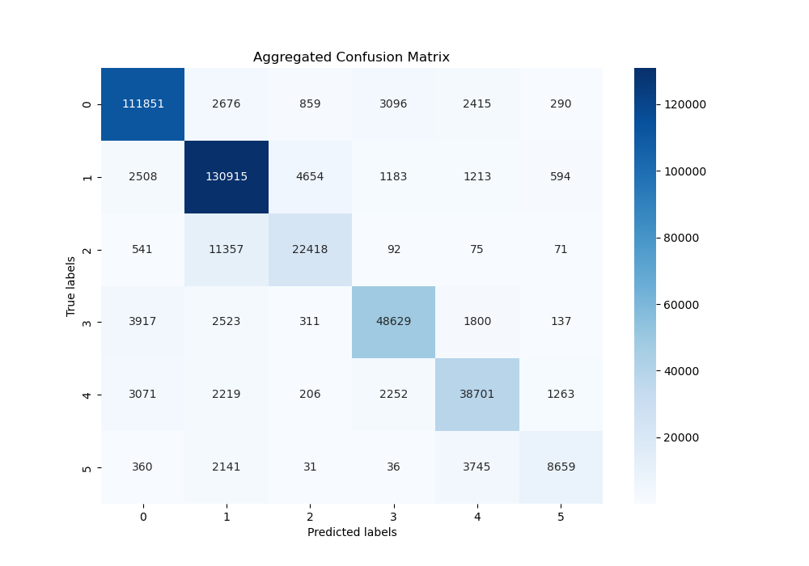

# Introduction/Background:

- **Introduction**: The project is based around using NLP for a more nuanced understanding of emotional context in text using 6 fundamental human emotions.
- **Literature review**: Pang and Lee [8] argue in their book that the field of sentiment analysis has evolved from broad classifications to detailed emotion detection due to the complexities of human language and sentiment. Deep learning, especially LSTM [6] and BERT [9], have revolutionized NLP, offering tools capable of a better nuanced understanding.
- **Dataset Description**: Contains english twitter messages with corresponding predominant emotion conveyed using six fundamental emotions denoted by numbers: sadness (0), joy (1), love (2), anger (3), fear (4), and surprise (5).

- Click [here](https://www.kaggle.com/datasets/nelgiriyewithana/emotions) to view the dataset from Kaggle.

  **Bar Chart Visualization**: 

  **Pie Chart Visualization**: 

  From the visualizations above, we can observe several aspects of our dataset. The bar chart illustrates that some emotions, such as joy and sadness, are more frequently represented in the dataset than others like love and surprise. Similarly, the pie chart provides a different perspective by showing the proportion of each emotion within the dataset. It highlights that nearly two thirds of the dataset is composed of tweets expressing joy and sadness, which could be indicative of the general sentiment found in public tweets or a bias in the way the dataset was collected.

# Problem Definition:

- **Problem**: Classifying exact emotions in text poses a challenge due to the subtle nuances in text. The project tries to solve this problem by accurately classifying text into one of six emotion categories.

- **Motivation**: Improved emotion detection has applications like aid in mental health assessment, customer feedback analysis, and social media monitoring. It’s crucial to develop AI that can respond to human emotions more empathetically.

# Preprocessing:

Based on Chai [1], we have implemented the following 3 data preprocessing methods:

- **Text Normalization**: We standardized the format of the text data to ensure consistency. This includes converting all text to lowercase and removing non-alphanumeric characters.
- **Tokenization**: We broke down sentences into individual words or tokens to prepare the data for vectorization and efficient processing.
- **Negation Handling**: To distinguish between good and not good more effectively, we appended a prefix to words following negations. This is crucial as Chai [1] emphasizes “preserving negation is essential.. removing the negation term will result in an opposite meaning and ambiguity….”

Using these 3 methods, we have a clean and structured dataset that can be easily analyzed, which helps optimize text data for analysis and model training.

# Models/Algorithms:

Based on research into NLP techniques, we selected and implemented 4 different algorithms to evaluate how each performed on our dataset:

### Naive Bayes

- **Implementation Details**:

  - **Gaussian Naive Bayes with Word2Vec**: For this model, we used Word2Vec to transform sentences into numerical vectors that capture the semantic meanings of words. These vectors were then into a Gaussian Naive Bayes, which assumes that features follow a normal distribution.

  - **Multinomial Naive Bayes with Bag-of-Words**: This model utilized Bag-of-Words to convert text into fixed-length vectors, where each entry represents the frequency of a word. This approach fits well with Multinomial Naive Bayes, which assumes data distribution to be multinomial.

- **Rationale**: Naive Bayes is well-established as a text classification technique because of its ability to handle large datasets efficiently and its effectiveness in probabilistic separation of classes. From our research, incorporating Word2Vec with Gaussian Naive Bayes seemed like a promising sentiment analysis [10]. However, in practice, this model underperformed due to the independence assumption of Gaussian Naive Bayes, which conflicts with the correlated features in Word2Vec. As a result, we also implemented Multinomial Naive Bayes, which complement the discrete counts from Bag-of-Words. Additionally, we opted to implement Naive Bayes first as it will be a great baseline to assess the performance of more complex models and understand our dataset further.

### Support Vector Machine (SVM)

- **Implementation Details**:

  - **Linear Kernel SVM**: We opted for a Linear Kernel SVM, believing that features might be linearly separable after vectorization with Bag-of-Words. This kernel is known for its efficiency and effectiveness when the features can be clearly divided by a linear boundary.

  - **RBF Kernel SVM**: To account for the possibility that the features are not linearly separable after vectorization, we also tested a Radial Basis Function (RBF) Kernel SVM. This approach was to determine if introducing non-linearity would improve classification accuracy.

- **Rationale**: Like Naive Bayes, SVM is known for its effectiveness in classification tasks because of its ability to provide clear margins of separation between classes, especially in high-dimensional spaces like those encountered in text analysis [11]. The linear kernel was selected due to its simplicity and the possibility that text data could be linearly separable vectorization with Bag-of-Words. However, to also test the possibility of introducing non-linearity, we explored using the RBF kernel as well. Implementing both kernels allowed us to directly compare the impact of assuming linear vs. non-linear separations in our data.

### RNN LSTM (Recurrent Neural Network with Long Short-Term Memory)

- **Implementation Details**: We implemented an LSTM model ...

- **Rationale**: LSTMs are particularly effective for tasks that require memory of past information, such as predicting the emotional tone of a sentence which may depend heavily on earlier parts of the text. The ability of LSTMs to avoid the long-term dependency problem commonly seen in standard RNNs made it an ideal choice for our project ... Something

### BERT (Bidirectional Encoder Representations from Transformers)

- **Implementation Details**: We implemented BERT by fine-tuning a pre-trained model on our dataset ...

- **Rationale**: BERT has revolutionized the field of NLP through its deep contextual understanding, which is critical for tasks like emotion detection where context significantly influences meaning [7] ...

### Evaluation and Initial Goals:

Each model was evaluated based on accuracy, precision, and F1-score. These evaluations helped us understand the strengths and weaknesses of each approach in the context of our dataset and project goals.

From our research, our project goals are to reach or beat the following metrics:

- Accuracy:
  - Naive Bayes: 74.1% [3]
  - SVM: 85%+ [3]
  - RNN: 85%+ [3]
  - BERT: 94% [3]
- Precision:
  - Naive Bayes: 50% [2]
  - SVM: 67% [2]
  - RNN: 95% [2]
  - BERT: 95%+
- F1 Score:
  - Naive Bayes: 0.49 [4]
  - SVM: 0.535 [4]
  - RNN: 0.54 [4]
  - BERT: 0.84 [7]

Building on these ideas, our planned performance ranking based on the 3 quantitiatve measures is: Naive Bayes < SVM < RNN < BERT.

# Results and Discussion:

### Naive Bayes

As stated before, we implemented 2 different versions of Naive Bayes, each using different feature extractions methods.

1. **Gaussian Naive Bayes with Word2Vec**:

   - Average Accuracy: ~40.5%
   - Average Precision: ~45.2%
   - Average F1-Score: 0.416

   This model's performance fell short of our expectations. While the combination of Word2Vec and Gaussian Naive Bayes was theoretically appealing due to Word2Vec's ability to capture semantics in text, the actual outcomes highlighted a mismatch. Gaussian Naive Bayes assumes that all features are independent and follow a normal distribution, which likely doesn't hold true for the dense and interdepedent feature vectors produced by Word2Vec. This mismatch likely led to the model's poor performance, where the average accuracy is far lower than proposed from 74% to around 40%. Despite this poor accuracy, the average F1-Scores and the average precision values are in the margin of error area and almost match our proposed values.

   

   The confusion matrix for the Gaussian Naive Bayes model reveals significant misclassifications across the board. The diagonal elements, which represent correct predictions, are generally outnumbered by the off-diagonal elements in several classes, demonstrating the high rate of incorrect classifications. Relatively speaking, the model performed the best on classifying `joy, but even for this emotion the predications were still quite scattered. Overall, from this matrix, we can guess that the semantic nuances between certain emotions were not captured effectively by the Gaussian model.

2. **Multinomial Naive Bayes with Bag-of-Words**:

   - Average Accuracy: ~85.8%
   - Average Precision: ~85.8%
   - Average F1-Score: 0.851

   Contrary to the Gaussian version, the Multinomial Naive Bayes model exceeded our expectations. The metrics are substantially better than the Gaussian implementation, with the average accuracy aligning more closely with our initial set goals. Using Bag-of-Words for feature extraction, which breaks down text into individual word counts, aligned well with multinomial probabilitic framework of a multinomial naive bayes. The synergy between the two allowed this implementation to capture relevant patterns that are representative of the different emotions, which allowed for the improved metrics.

   

   Analyzing the confusion matrix for the Multinomial Naive Bayes model, we see a stark contrast to the Gaussian variant. The diagonal elements, indicating correct classifications, are more prominent across all emotional categories, which suggests the model was able discern between different emotions effectively. Notably, the precision for the sadness (0) and joy (1) were particularly high However, there is room for improvement in correctly classifying less frequent emotions, such as love (2) and surprise (5). From the matrix, we can see that the model still confuses them with other emotions, espcially surprise.

### SVM (Support Vector Machine)

For SVM, we tested our implementation using two different kernels, a linear one and non-linear rbf (Radial Basis Function). We utilized a guess and check system to test for linear seperability because after vectorization, we have 57697 features, which is difficult to visualize.

1. **SVM using RBF Kernel**

   - Average Accuracy: ~86.6519%
   - Average Precision: ~86.46919
   - Average F1-Score: 0.864026

   This implementation performed quite well. The use of the RBF kernel was intended to capture non-linear patterns post-vectorization which are not immediately apparent. However, the slight underperformance compared to the Linear Kernel SVM could suggest that the dataset's features might be more linearly separable than initially anticipated or that we need to optimize the hyperparamters of the model further.
   

   The confusion matrix for the RBF Kernel SVM displays a strong diagonal concentration, indicating a high rate of correct predictions. However, there are noticeable misclassifications, particularly between emotions fear (4) and surprise (5) and joy (1) and love (2). This indicates that the model might have had trouble differentiating between the finer emotional sentiments. However, overall, the model performed well.

2. **SVM using Linear Kernel**

   - Average Accuracy: ~88.2946%
   - Average Precision: ~88.2895%
   - Average F1-Score: 0.882915

   The Linear Kernel SVM outperformed the RBF Kernel SVM, suggesting the feature space, post-vectorization, might indeed be linearly separable to a large degree. The high performance across accuracy, precision, and F1-score metrics indicates that this model was effective in creating a decision boundary that correctly separates the different emotion classes without needing the complexity of a non-linear kernel.

   

   Analyzing the confusion matrix of the Linear Kernel SVM, we see a clear distinction in the diagonal elements, which represent correct classifications. The model shows strong performance especially in classifying sadness (0) and joy (1). However, it does seem to slightly struggle in distinguishing between joy (1) and love (2). Overall, from the matrix, the linear kernel was particularly effective at distinguishing between the different emotions.

### We also created two jupyter notebook that explain each of these algorithms. These can be accessed on the GitHub repository or using these links(hosted on another application):
https://mybinder.org/v2/gh/CS4641-Project/CS4641-website/main?labpath=emotions.ipynb

### Comparing Different Models:

Analyzing the results, we observed that the SVM implementations outperformed the Naive Bayes classifiers, with improvements of approximately 3% across accuracy, precision, and F1-score metrics, when comparing multinomial naive bayes and linear kernel SVM. This peromance increases is likely due to SVM's robustness in handling high-dimensional data and its capacity for creating optimal hyperplanes that separate the various classes. Since it looks to maximize the margin and create the widest possible gap between them, SVM is particularly strong at text classification tasks.

However, this increase in performance comes with trade-offs. One of the most significant is computational efficiency—SVM models, especially those with RBF kernels, require more intensive computation to identify the optimal boundary. During our project, the training time for SVM was approximately four times longer than that for the Naive Bayes models, and when consider practical applications, this trade-off needs to be evaluated appropriately. Naive bayes, while less accurate, does have some uses. Its assumption that features are indepdent allows for a simplier model and faster training times, which can be valuable at times. Similarly, Naive Bayes models understand the probabilities underlying the features, making it more informative if we need to udnerstand the likelihood of each class.

# Next Steps:

Going forward, we have many routes to take. We can continue testing additional classification algorithms such as logistic regression. Alternatively, we can compile a new dataset that more accurately captures the breadth of emotions out there, and train our models on this new dataset to better suit our solution. Finally, we have plans to implement a GUI and host our trained models, so that users can input a sentence and get the corresponding sentiment.

# Gnatt Chart:

[Download CSV](UpdatedGanttChart.xlsx)

# Contribution Table:

| Name              | Proposal Contributions                                                                      |
| :---------------- | :------------------------------------------------------------------------------------------ |
| Ian Rausch        | Github pages updates, Coding Models and data processing (Main)                              |
| Parag Ambildhuke  | Github pages updates, Midterm Checkpoint Report, data processing, directed meeting schedule |
| Pritesh Rajyaguru | Github pages updatea, Midterm Checkpoint Report, data processing, directed meeting schedule |
| Shubham Dhar      | Github pages updates, Midterm Checkpoint Report, data processing, discussion with TA        |
| Zachary Seletsky  | Github pages updates, Coding Models and data processing, discussion with TA                 |

# References:

[1] C. P. Chai, “Comparison of text preprocessing methods,” Natural Language Engineering, vol. 29, no. 3, pp. 509–553, 2023. doi:10.1017/S1351324922000213

[2] K. Machová, M. Szabóova, J. Paralič, and J. Mičko, “Detection of emotion by Text Analysis Using Machine Learning,” Frontiers in Psychology, vol. 14, Sep. 2023. doi:10.3389/fpsyg.2023.1190326

[3] P. Nandwani and R. Verma, “A review on sentiment analysis and emotion detection from text,” Social Network Analysis and Mining, vol. 11, no. 1, Aug. 2021. doi:10.1007/s13278-021-00776-6

[4] E. Batbaatar, M. Li, and K. H. Ryu, “Semantic-emotion neural network for emotion recognition from text,” IEEE Access, vol. 7, pp. 111866–111878, Aug. 2019. doi:10.1109/access.2019.2934529

[5] A. Chatterjee, U. Gupta, M. K. Chinnakotla, R. Srikanth, M. Galley, and P. Agrawal, “Understanding Emotions in Text Using Deep Learning and Big Data,” Computers in Human Behavior, vol. 93, pp. 309–317, Apr. 2019, doi: https://doi.org/10.1016/j.chb.2018.12.029.

[6] S. Hochreiter and J. Schmidhuber, “Long Short-Term Memory,” Neural Computation, vol. 9, no. 8, pp. 1735–1780, Nov. 1997, doi: https://doi.org/10.1162/neco.1997.9.8.1735.

[7] I. Albu and S. Spînu, "Emotion Detection From Tweets Using a BERT and SVM Ensemble Model," ArXiv.Org, 2022. Available: https://www.proquest.com/working-papers/emotion-detection-tweets-using-bert-svm-ensemble/docview/2700434497/se-2.

[8] B. Pang and L. Lee, Opinion mining and sentiment analysis. Boston: Now Publishers, 2008.

[9] J. Devlin, M.-W. Chang, K. Lee, and K. Toutanova, “BERT: Pre-training of Deep Bidirectional Transformers for Language Understanding,” arXiv.org, Oct. 11, 2018. https://arxiv.org/abs/1810.04805

‌[10] T. Mikolov, K. Chen, G. Corrado, and J. Dean, “Efficient Estimation of Word Representations in Vector Space,” arXiv.org, Sep. 07, 2013. https://arxiv.org/abs/1301.3781

[11] “Support vector machines - IEEE Journals & Magazine,” Ieee.org, 2019. https://ieeexplore.ieee.org/document/708428
